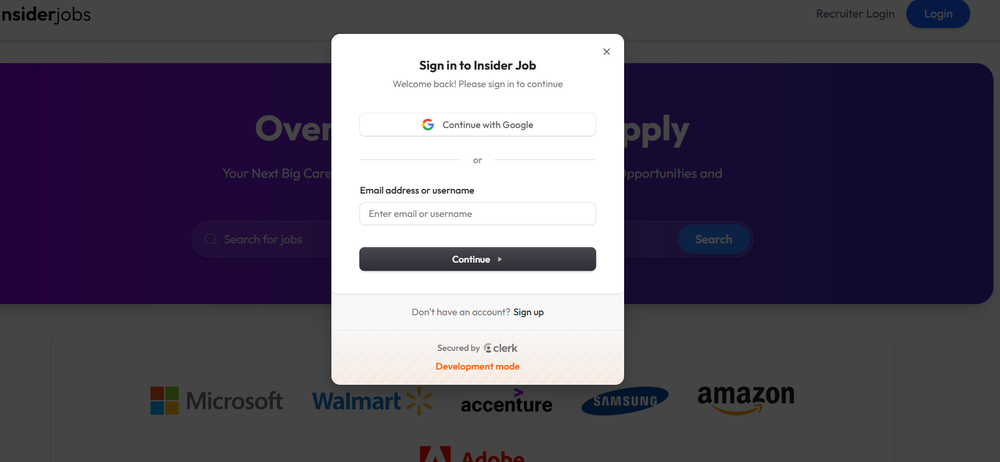
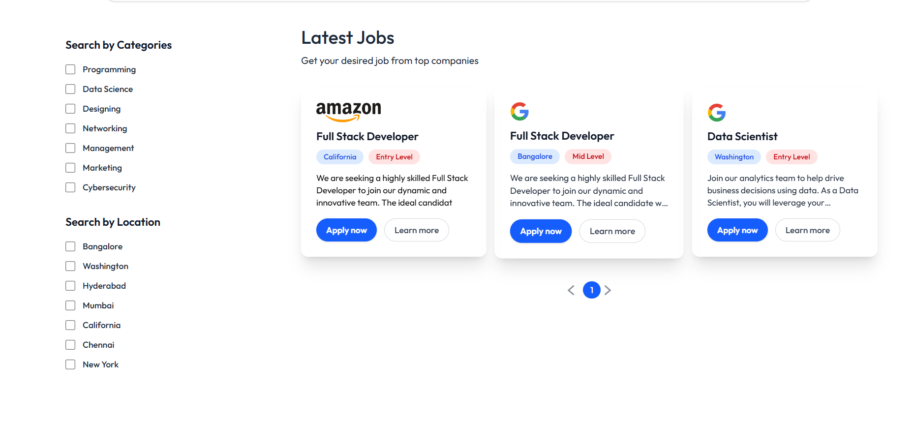
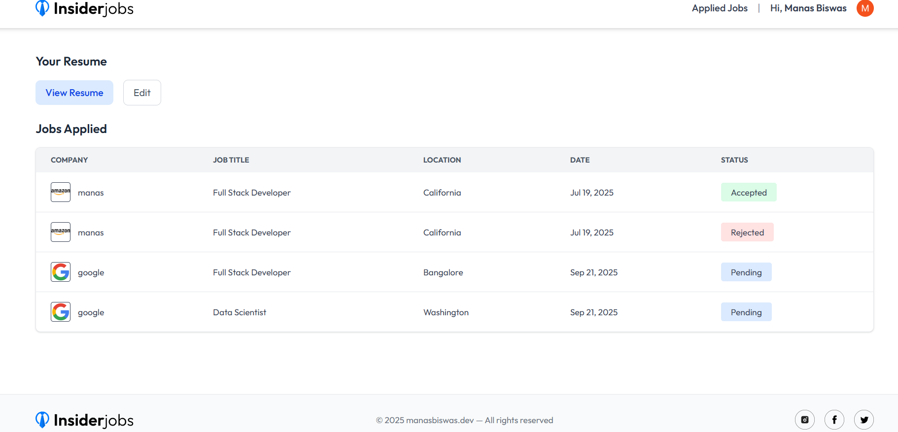
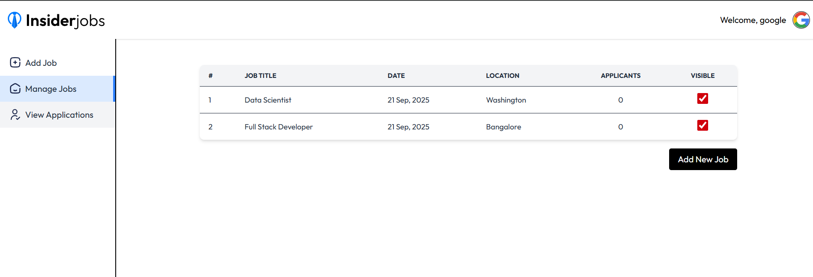

# 🏢 Job Portal

A **Full Stack Job Portal Website** built with **MongoDB, Express, React, and Node.js (MERN)**.  
Job seekers can search and apply for jobs online, upload resumes, and manage their profiles. Recruiters can post jobs, manage applicants, and track applications seamlessly.  

🔗 **[Live Demo](https://insider-jobs.onrender.com/)**  


---

## 📂 Project Structure  
```

JOB-PORTAL/
│── client/
│── Server/
│── Pictures/ # For README
│── .gitignore
│── README.md

```


---

## ✨ Features  

### 👨‍💼 For Job Seekers  
- Create an account and log in using **Clerk Authentication**.  
- Search and filter job listings.  
- Apply for jobs and upload resumes.  
- Manage applications and track status.  

### 🏢 For Recruiters  
- Post new job openings.  
- Manage published job posts.  
- View applicants and their resumes.  
- Accept or reject job applications.  

### ⚙️ Additional Features  
- **Error Tracking & Performance Monitoring** with **Sentry**.  
- **MongoDB query monitoring** for performance optimization.  
- Responsive UI with smooth user experience.  

---

## 📸 Screenshots   

### 🔑 Authentication (Clerk Login)  
  

### 🏠 User Dashboard  
  
  
  

### 📋 Recruiter Dashboard  
  
  
  

---


## 🚀 Tech Stack  

- **Frontend:** React.js, TailwindCSS  
- **Backend:** Node.js, Express.js  
- **Database:** MongoDB  
- **Authentication:** Clerk  & JWT
- **Error Monitoring:** Sentry  

---

## 📌 Installation & Setup  

```bash
# 1. Clone the repository
git clone https://github.com/stud-manasbiswas/JOB-PORTAL.git
cd JOB-PORTAL

# 2. Install dependencies for both client & server
cd client && npm install
cd ../Server && npm install

# 3. Start the development servers

# Start Client
cd client
npm run dev

# Start Server
cd ../Server
npm run dev


